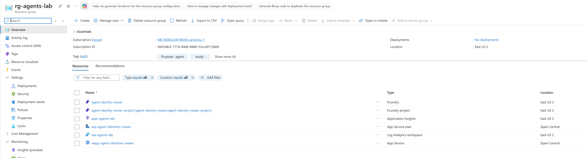
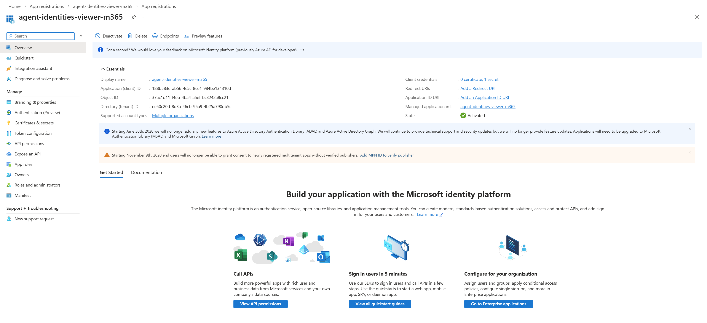
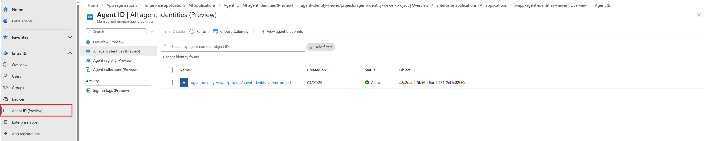
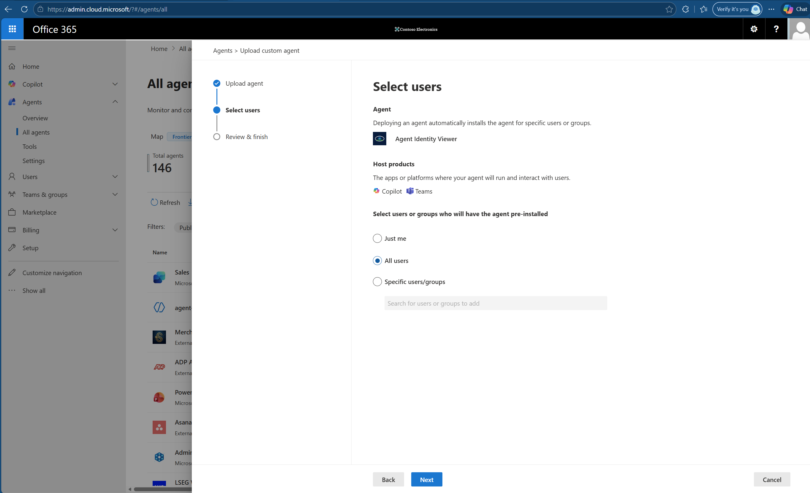
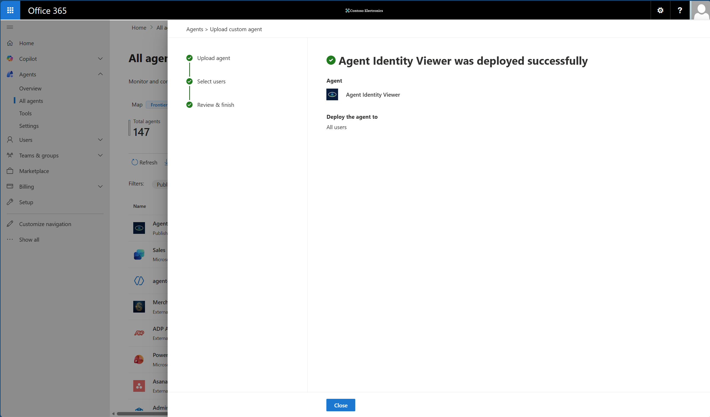
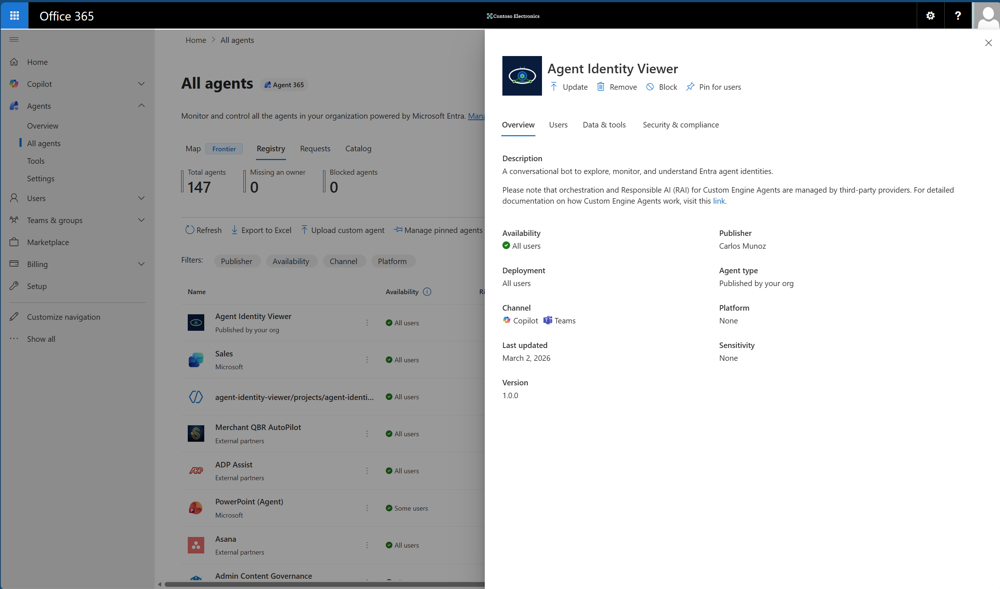
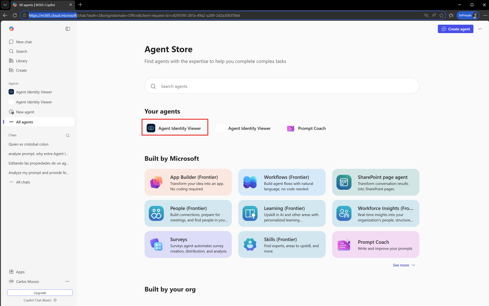
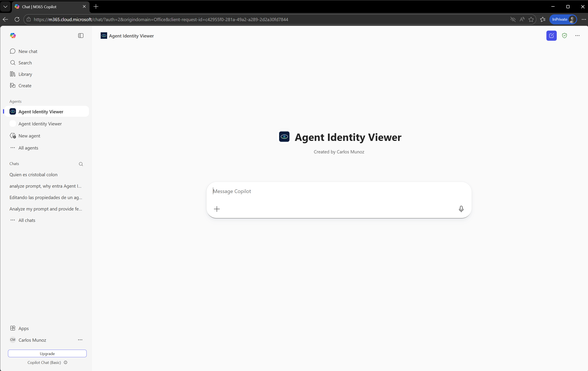

# Runbook unificado M365 — CLI + Local + Túnel + Infra + Cloud

Runbook maestro para ejecutar validaciones operativas end-to-end 

## 0) Prerrequisitos globales

- `.venv` creado e instalado con `requirements.txt`.
- `az login` activo en la suscripción correcta. Permisos de Global Admin necesarios para el despliegue de infraestructura
- `teamsapptester` instalado. Para la realización de pruebas de Playground (npm necesario para instalar este componente)
- Fichero de infraestructura: `infra/config/lab-config.ps1` configurado.
- devtunnel instalado, para las pruebas contra recursos cloud.
```powershell
winget install --id Microsoft.devtunnel -e --accept-package-agreements --accept-source-agreements
```
- El fichero .env se auto-rellena como resultado de la ejecuión de los scripts de infraestructura indicados en puntos posteriores.

Comprobación rápida:

```powershell
Set-Location c:/Users/carlosmu/Documents/code/ms-agents-ecosystem-lab
az account show --output table
python --version
node --version
npm --version
teamsapptester --version
```

Instalación de dependencias (si faltan):

```powershell
pip install -r requirements.txt
npm install -g @microsoft/teams-app-test-tool
```

## 1) Implementación de la infraestructura. bootstrap base:

Implementa, Resource Group, Foundry Project, Model deployment, Service Principals para autenticación, Web App Services + Web App, Managed Identity para Web App, Cognition role para WEb App, componentes de observabilidad y cumplimenta .env

```powershell
Set-Location .\infra\scripts
.\deploy-all.ps1
```

***PASS esperado:***
- Los siguientes recursos deben haberse implementado, nótese que debido a problemas de cuota, ciertos recursos como la Web app y el Application Service Plan se implementa en una región distinta a la del resto de recursos (todo ello definido en /infra/config/lab-config.ps1)



- Creación de Service Principal (App Registration + su Service Principal así como su Enterprise App asociado). Identidad asociada al Bot (MICROSOFT_APP_ID + Secreto en .env) para autenticarse con el Framework de Teams/Bot




- Web App Managed Identity (Enterprise Application menu), creada para asignar a la Web App el role Cognitive services de forma que pueda ejecutar el modelo de Foundry


- Instancia agéntica del proyecto de Foundry en Agent 365



## 2) Validación test CLI

Preparación de variables operativas

```powershell
$repo = "c:/Users/carlosmu/Documents/code/ms-agents-ecosystem-lab"
Set-Location "$repo"
.\.venv\Scripts\python.exe .\main.py cli
```
### Validación:

***PASS esperado:***
- Arranca sin excepción.
- IA responde con cualquier prompt.
- Sale limpio con `exit`.


## 3) Arranque del runtime M365

```powershell
$repo = "c:/Users/carlosmu/Documents/code/ms-agents-ecosystem-lab"
Set-Location "$repo"
.\.venv\Scripts\python.exe .\main.py
```

### Validación:

**3.1 Control de autenticación**
```powershell
Invoke-RestMethod -Uri "http://localhost:3978/api/messages" -Method Get
```

***PASS esperado: Error  `401` por enforcement de auth.***

**3.2 Playground local**

Cargar variables de .env en la sesión actual
```powershell
Get-Content .env | ForEach-Object {
  if ($_ -match '^\s*#' -or $_ -match '^\s*$') { return }
  if ($_ -match '^\s*([^=]+)=(.*)$') {
    [Environment]::SetEnvironmentVariable($matches[1].Trim(), $matches[2].Trim(), 'Process')
  }
}
```
Validar variables requeridas
```powershell
$cid = $env:MICROSOFT_APP_ID
$cs  = $env:MICROSOFT_APP_PASSWORD
$tid = $env:MICROSOFT_APP_TENANTID

if ([string]::IsNullOrWhiteSpace($cid) -or [string]::IsNullOrWhiteSpace($cs) -or [string]::IsNullOrWhiteSpace($tid)) {
  throw "Faltan variables MICROSOFT_APP_ID / MICROSOFT_APP_PASSWORD / MICROSOFT_APP_TENANTID"
}

teamsapptester start -e http://127.0.0.1:3978/api/messages --channel-id msteams --delivery-mode expectReplies --cid $cid --cs $cs --tid $tid
```
***PASS esperado: Los comandos `/help`, `/clear`, mensaje libre responden correctamente.***

**3.3 Playground expuesto via dev tunnel**

Manteniendo el Runtime de M365 ejecutamos en otro terminal devtunnel

```powershell
devtunnel user login --entra --use-browser-auth
devtunnel host -p 3978 --allow-anonymous
```
En un tercer teminal ejecutamos los siguientes comandos:

1.- Cargar variables de .env en la sesión actual
```powershell
Get-Content .env | ForEach-Object {
  if ($_ -match '^\s*#' -or $_ -match '^\s*$') { return }
  if ($_ -match '^\s*([^=]+)=(.*)$') {
    [Environment]::SetEnvironmentVariable($matches[1].Trim(), $matches[2].Trim(), 'Process')
  }
}
```

2.- Validar variables requeridas
```powershell
$cid = $env:MICROSOFT_APP_ID
$cs  = $env:MICROSOFT_APP_PASSWORD
$tid = $env:MICROSOFT_APP_TENANTID

if ([string]::IsNullOrWhiteSpace($cid) -or [string]::IsNullOrWhiteSpace($cs) -or [string]::IsNullOrWhiteSpace($tid)) {
  throw "Faltan variables MICROSOFT_APP_ID / MICROSOFT_APP_PASSWORD / MICROSOFT_APP_TENANTID"
}
```

3.- Probar Playground contra túnel, sustituyendo <tu-subdominio> por el FQDN devuelto por devtunnel Ej. https://s4fl4hc5-3978.uks1.devtunnels.ms
```powershell
teamsapptester start -e https://<tu-subdominio>/api/messages --channel-id msteams --delivery-mode expectReplies --cid $env:MICROSOFT_APP_ID --cs $env:MICROSOFT_APP_PASSWORD --tid $env:MICROSOFT_APP_TENANTID
```

***PASS esperado: Los comandos `/help`, `/clear`, mensaje libre responden correctamente.***

## 4) Despliegue en Cloud

Este proceso crea el paquete de aplicación y lo subre a la web app creada previamente como parte de la infraestructura.
Adicionalmente crea los manifiestos que serán necesarios para publicar la aplicación en Teams

**4.1 Generación de manifiesto y desplieque del codigo**

```powershell
Set-Location c:/Users/carlosmu/Documents/code/ms-agents-ecosystem-lab
.\dist\dev\build-m365-manifest.ps1
```

Nota: Para la publicación de la aplicación en Teams, historicamente sólo era necesario el archivo manifest.json y opcionalmente los iconos de color y outliner. Con el nuevo modelo impuesto por Agent 365 se incorpora el archivo agenticUserTemplateManifest.json, que en este caso es una copia exacta del archivo de manifiesto.

***PASS esperado:***

Deployment has completed successfully
You can visit your app at: http://wapp-agent-identities-viewer.azurewebsites.net

Location       Name                                  ResourceGroup
-------------  ------------------------------------  ---------------      
Spain Central  2cb64371-4a60-4684-8dd8-40f8a5cb0b06  rg-agents-lab        
Manifest generado: C:\Users\carlosmu\Documents\code\ms-agents-ecosystem-lab\dist\deploy\m365\manifest\manifest.json
Paquete manifest: C:\Users\carlosmu\Documents\code\ms-agents-ecosystem-lab\dist\deploy\m365\package\manifest.zip
Paquete appservice: C:\Users\carlosmu\Documents\code\ms-agents-ecosystem-lab\dist\deploy\webapp\package\webapp.zip
WebApp: wapp-agent-identities-viewer
ResourceGroup: rg-agents-lab
Deployment appservice: OK

**4.2 3 Playground ejecutado contra entorno cloud**

1.- Cargar variables de .env en la sesión actual
```powershell
Get-Content .env | ForEach-Object {
  if ($_ -match '^\s*#' -or $_ -match '^\s*$') { return }
  if ($_ -match '^\s*([^=]+)=(.*)$') {
    [Environment]::SetEnvironmentVariable($matches[1].Trim(), $matches[2].Trim(), 'Process')
  }
}
```

2.- Validar variables requeridas
```powershell
$cid = $env:MICROSOFT_APP_ID
$cs  = $env:MICROSOFT_APP_PASSWORD
$tid = $env:MICROSOFT_APP_TENANTID

if ([string]::IsNullOrWhiteSpace($cid) -or [string]::IsNullOrWhiteSpace($cs) -or [string]::IsNullOrWhiteSpace($tid)) {
  throw "Faltan variables MICROSOFT_APP_ID / MICROSOFT_APP_PASSWORD / MICROSOFT_APP_TENANTID"
}
```

3.- Ejecutar teamsapptester 
```powershell
teamsapptester start -e https://wapp-agent-identities-viewer.azurewebsites.net/api/messages --channel-id msteams --delivery-mode expectReplies --cid $env:MICROSOFT_APP_ID --cs $env:MICROSOFT_APP_PASSWORD --tid $env:MICROSOFT_APP_TENANTID
```

***PASS esperado: Los comandos `/help`, `/clear`, mensaje libre responden correctamente.***

## 5) Validación en Copilot y Microsoft Teams

1. Cargar/actualizar el manifest generado (`dist/deploy/m365/package/manifest.zip`) en el tenant de destino.
- Ir a admin.microsoft.com / Agents / All Agents / Upload Custom Agent
- 

***PASS esperado:*** 
- Publicación satisfactoria del agente

- Agente visible en registro

- Comprobar la instalación de la aplicación desde Teams. Conectar con un usuario de pruebas, con permisos para instalar la aplicación a https://login.microsoftonline.com
- Desde https://m365.cloud.microsoft/ al seleccionar All Agents, debe aparecer nuestro agente

- Copilot o Teams debe permitir la ejecución del agente

- Interactuar con el agente, debe responder correctamente a /help /clear y uso del modelo