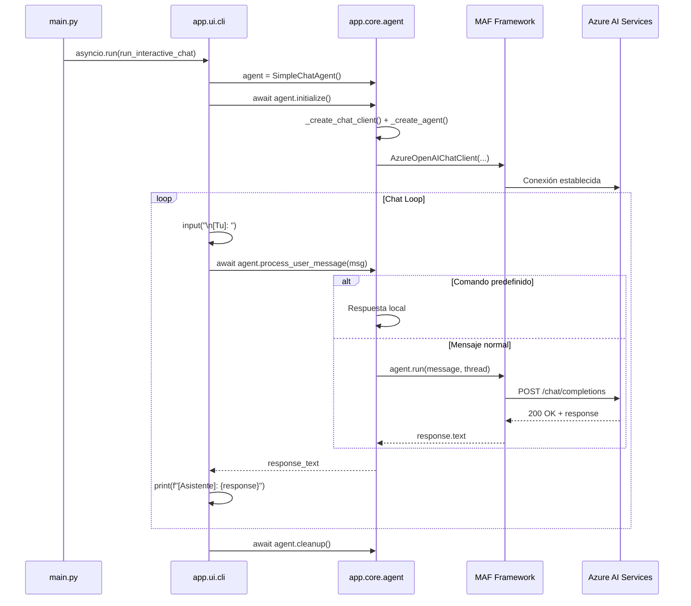

# MAF Simple Chat

Un agente conversacional interactivo implementado con **Microsoft Agent Framework (MAF)** que se conecta a Azure AI Foundry para interactuar con modelos de lenguaje.

## 📋 Descripción

Este proyecto demuestra cómo construir un chatbot simple usando el framework MAF, que proporciona abstracciones de alto nivel para gestionar agentes de IA. El agente:

- **Se conecta a Azure AI Services** mediante endpoints configurables
- **Usa Azure OpenAI** para generar respuestas basadas en IA
- **Mantiene contexto conversacional** a través de hilos de agente (`AgentThread`)
- **Soporta autenticación flexible**: API Key o Azure CLI (`az login`)
- **Registra eventos** de manera estructurada para debugging y auditoría

## 🏗️ Arquitectura

```
app/
├── core/                      # Lógica de negocio
│   ├── interfaces.py         # Contrato AgentInterface
│   └── agent.py              # Implementación SimpleChatAgent
│
└── ui/                        # Interfaz de usuario
    └── cli.py                # Chat interactivo en terminal

main.py                        # Punto de entrada
```

### Módulos

| Módulo | Propósito |
|--------|-----------|
| `app.core.interfaces` | Define `AgentInterface` - contrato para todos los agentes |
| `app.core.agent` | Implementa `SimpleChatAgent` - agente conversacional |
| `app.ui.cli` | Proporciona `run_interactive_chat()` - interfaz terminal |
| `main.py` | Punto de entrada único de la aplicación |

## 📦 Requisitos

- **Python 3.11+**
- **Virtual Environment** (recomendado)
- **Azure CLI** (para autenticación con `az login`)
- **Dependencias** listadas en `requirements.txt` (nivel raíz)

## 🚀 Instalación

### 1. Preparar el Entorno

```bash
# Desde la raíz del repositorio
cd ../../..

# Crear e instalar dependencias
python -m venv .venv
.venv\Scripts\activate          # (Windows)
# source .venv/bin/activate    # (Linux/Mac)

pip install -r requirements.txt
```

### 2. Configurar Variables de Entorno

Copia `.env.example` a `.env` en la **raíz del repositorio**:

```bash
# Desde la raíz del repo (ms-agents-ecosystem-lab/)
copy platforms/maf/01-simple-chat/.env.example .env
```

Luego edita `.env` con tus valores:

```env
ENDPOINT_API=https://foundry-maf-lab.services.ai.azure.com
DEPLOYMENT_NAME=gpt-4o-mini
PROJECT_NAME=maf
API_VERSION=2024-10-21
API_KEY=tu-api-key-aqui-opcional
```

**Orígenes de la configuración:**

- **Automático**: Ejecuta `/infra/scripts/show-endpoints.ps1` para generar `.env`
- **Manual**: Obtén valores de Azure Portal → AI Foundry → Configuración del Proyecto

### 3. Autenticación Azure

Inicia sesión con Azure CLI:

```bash
az login
```

Esto establece tu contexto de autenticación. Si defines `API_KEY` en `.env`, se usará en su lugar.

## ▶️ Ejecución

```bash
# Desde platforms/maf/01-simple-chat/
python main.py
```

### Ejemplo de Sesión

```
============================================================
 CHAT INTERACTIVO - Microsoft Agent Framework
============================================================
 Escribe 'exit' o 'salir' para terminar
 Escribe 'clear' o 'limpiar' para limpiar el historial
============================================================

[Tu]: ¿Cuál es el capital de Francia?

[Asistente]: El capital de Francia es París.

[Tu]: clear
[Asistente]: Historial limpiado. Nuevo chat iniciado.

[Tu]: exit
[Asistente]: ¡Adiós! Que tengas un buen día.
```

### Comandos Disponibles

| Comando | Efecto |
|---------|--------|
| `exit`, `salir`, `quit` | Termina la sesión |
| `clear`, `limpiar` | Limpia el historial y reinicia el hilo del agente |
| Cualquier otro texto | Se envía al agente para procesamiento |

## 🔍 Logging

El agente registra eventos en diferentes niveles:

- **DEBUG**: Trazas de variables, inicialización de componentes
- **INFO**: Operaciones exitosas (✅ markers)
- **ERROR**: Fallos con contexto de excepción

Los logs de dependencias externas (httpx, azure) se suprime al nivel DEBUG para mantener la interfaz limpia.

```
INFO:agent:✅ Cliente de chat creado exitosamente.
INFO:agent:✅ Agente creado y vinculado al cliente de chat.
INFO:agent:✅ Hilo del agente iniciado exitosamente.
INFO:agent:✅ Agente inicializado y listo para interactuar.
```

## 🧪 Tests

```bash
# Unit tests
pytest tests/unit/

# Integration tests
pytest tests/integration/

# Todo
pytest tests/
```

## 🔧 Personalización

### Cambiar el Prompt del Agente

Edita `AGENT_PROMPT` en [app/core/agent.py](app/core/agent.py#L23):

```python
AGENT_PROMPT = (
    "Eres un experto en ciberseguridad. "
    "Responde de forma técnica pero comprensible. "
    "Incluye ejemplos cuando sea posible."
)
```

### Añadir Respuestas Predefinidas

Modifica `process_user_message()` en [app/core/agent.py](app/core/agent.py#L112):

```python
elif "ayuda" in message.lower():
    response = "Puedo ayudarte con: preguntas generales, codificación, análisis de texto..."
```

### Extender con Herramientas (Tools)

El campo `tools=[]` en `_create_agent()` está preparado para futuras herramientas. Sistema MAF soporta agentic tools en futuras versiones.

## 📐 Flujo de Ejecución



## 📁 Estructura de Directorios

```
platforms/maf/01-simple-chat/
├── main.py                # Punto de entrada
├── .env.example          # Plantilla variables entorno
├── README.md             # Este archivo
│
├── app/                  # Código fuente
│   ├── __init__.py
│   ├── core/             # Lógica de negocio
│   │   ├── __init__.py
│   │   ├── interfaces.py # Contrato Agent
│   │   └── agent.py      # SimpleChatAgent
│   │
│   └── ui/               # Interfaz usuario
│       ├── __init__.py
│       └── cli.py        # Chat terminal
│
└── tests/                # Suite de tests
    ├── __init__.py
    ├── unit/             # Tests unitarios
    │   └── __init__.py
    └── integration/      # Tests de integración
        └── __init__.py
```

## 🐛 Troubleshooting

### Error: `No module named 'agent_framework'`
```bash
pip install --upgrade --pre agent-framework
```

### Error: `ENDPOINT_API not found in environment`
- Verifica que `.env` está en la **raíz del repo** (no en `platforms/maf/01-simple-chat/`)
- Asegúrate de que las claves están exactas: `ENDPOINT_API`, no `ENDPOINT_api`

### Error: "AzureCliCredential failed"
```bash
az login
az account show  # Verifica que estás autenticado
```

### Logs de httpx aparecen en la interfaz
- Ya está resuelt con `logging.getLogger("httpx").propagate = False`
- Si persiste, verifica que `agent.py` se carga correctamente

## 📚 Recursos

- [Microsoft Agent Framework Documentation](https://aka.ms/agent-framework-docs)
- [Azure AI Foundry](https://ai.azure.com/)
- [Azure Identity Python SDK](https://learn.microsoft.com/python/api/overview/azure/identity-readme?view=azure-python)
- [Python asyncio](https://docs.python.org/3/library/asyncio.html)

## 📝 Licencia

Parte del ecosistema MS-Agents-Ecosystem-Lab

## 👤 Autor

Desarrollado como ejemplo de MAF en MS-Agents Ecosystem Lab
